# 智能占星助手 - Intelligent Astrology Assistant

## 🌟 項目簡介

這是一個整合了多種 AI 技術的智能占星助手系統，結合了：

- **LangGraph ReActAgent** - 核心推理引擎
- **MCP (Model Context Protocol) 工具** - 網路搜尋和占星計算
- **RAG (Retrieval-Augmented Generation)** - 占星學知識庫檢索
- **Azure OpenAI GPT-4** - 語言模型
- **FastAPI** - 後端 API 服務
- **繁體中文前端界面** - 包含星圖顯示功能

## 🏗️ 系統架構

```
用戶輸入 → ReActAgent → 工具選擇器 → 多工具執行 → 結果整合 → 占星分析
                           ↓
                    ┌─ RAG搜尋工具 ────┐
                    ├─ WebSearchMCP ───┤ → 知識融合 → 專業解讀
                    └─ AstroMCP ───────┘
```

## 📁 檔案結構

````
0731demo/
# 🌟 智能占星助手 (Enhanced Astro Agent)

一個基於 LangGraph ReActAgent、MCP 工具和 RAG 檢索技術的智能占星助手系統，提供專業的占星分析和諮詢服務。

## 📋 目錄

- [專案概述](#專案概述)
- [系統架構](#系統架構)
- [功能特色](#功能特色)
- [技術棧](#技術棧)
- [環境要求](#環境要求)
- [安裝指南](#安裝指南)
- [配置設定](#配置設定)
- [啟動流程](#啟動流程)
- [API 文檔](#api-文檔)
- [專案結構](#專案結構)
- [開發指南](#開發指南)
- [部署說明](#部署說明)
- [故障排除](#故障排除)
- [貢獻指南](#貢獻指南)

## 🌌 專案概述

智能占星助手是一個現代化的占星分析平台，結合了人工智能和傳統占星學知識。系統採用前後端分離架構，提供流暢的用戶體驗和強大的占星分析功能。

### 核心特色

- **智能對話**: 基於 GPT-4 的自然語言處理，提供人性化的占星諮詢
- **專業分析**: 整合傳統占星學知識和現代心理學洞察
- **實時計算**: 精確的星盤計算和天體位置分析
- **知識檢索**: RAG 技術支持的占星知識庫查詢
- **流式回應**: 實時的對話體驗，支持 Server-Sent Events
- **模組化設計**: 可擴展的 MCP 工具系統

## 🏗️ 系統架構



```mermaid
graph TB
    subgraph "前端層 (Frontend)"
        A[Next.js 應用]
        B[React 組件]
        C[TypeScript]
    end

    subgraph "API 層 (Backend API)"
        D[Quart API 服務器]
        E[CORS 中間件]
        F[流式端點]
    end

    subgraph "核心 Agent 層"
        G[Enhanced Astro Agent]
        H[LangGraph ReActAgent]
        I[系統提示管理]
    end

    subgraph "工具層 (Tools)"
        J[MCP 工具]
        K[RAG 檢索工具]
        L[占星計算工具]
    end

    subgraph "外部服務"
        M[Azure OpenAI]
        N[Pinecone 向量數據庫]
        O[占星數據源]
    end

    A --> D
    D --> G
    G --> H
    H --> J
    H --> K
    H --> L
    K --> N
    G --> M
    L --> O
```

## ✨ 功能特色

### 🎯 核心功能

1. **智能占星諮詢**

   - 自然語言對話界面
   - 專業占星師風格的回應
   - 個性化的星盤解讀

2. **星盤分析**

   - 精確的出生星盤計算
   - 行星位置和相位分析
   - 宮位系統解釋

3. **知識檢索**

   - RAG 技術支持的占星知識庫
   - 相關性排序的搜索結果
   - 上下文感知的信息提取

4. **實時互動**
   - 流式對話體驗
   - 即時回應生成
   - 支援長時間對話

### 🛠️ 技術特色

- **模組化架構**: 基於 MCP 協議的可擴展工具系統
- **異步處理**: 全異步的後端架構，支持高並發
- **類型安全**: TypeScript 和 Python 類型提示
- **容器化**: Docker 支持，便於部署和擴展

## 🔧 技術棧

### 後端技術

| 技術         | 版本   | 用途           |
| ------------ | ------ | -------------- |
| Python       | ≥3.12  | 主要開發語言   |
| Quart        | Latest | 異步 Web 框架  |
| LangGraph    | ≥0.2.0 | Agent 框架     |
| LangChain    | ≥0.3.0 | LLM 應用框架   |
| Azure OpenAI | ≥0.2.0 | 大語言模型服務 |
| Pinecone     | ≥5.0.0 | 向量數據庫     |
| MCP Adapters | ≥0.1.0 | 模型上下文協議 |

### 前端技術

| 技術         | 版本    | 用途        |
| ------------ | ------- | ----------- |
| Next.js      | 15.4.5  | React 框架  |
| React        | 19.1.0  | UI 庫       |
| TypeScript   | ^5      | 類型安全    |
| Tailwind CSS | ^4      | 樣式框架    |
| Axios        | ^1.11.0 | HTTP 客戶端 |

### MCP 工具

| 工具       | 語言       | 功能         |
| ---------- | ---------- | ------------ |
| AstroMCP   | TypeScript | 占星數據查詢 |
| Web Search | TypeScript | 網路搜索功能 |

## 📋 環境要求

### 系統要求

- **操作系統**: Windows 10/11, macOS 10.15+, Ubuntu 18.04+
- **Python**: 3.12 或更高版本
- **Node.js**: 18.0 或更高版本
- **Yarn**: 1.22 或更高版本
- **記憶體**: 最少 4GB RAM (建議 8GB+)
- **存儲空間**: 最少 2GB 可用空間

### 必要的 API 金鑰

- Azure OpenAI API 金鑰和端點
- Pinecone API 金鑰 (用於 RAG 功能)
- 搜索 API 金鑰 (可選，用於網路搜索)

## 🚀 安裝指南

### 1. 克隆專案

```bash
git clone <repository-url>
cd 0731demo
```

### 2. 後端環境設置

#### 創建虛擬環境

```bash
# 使用 Python venv
python -m venv venv

# 啟動虛擬環境
# Windows
venv\Scripts\activate
# macOS/Linux
source venv/bin/activate
```

#### 安裝 Python 依賴

```bash
pip install -r requirements.txt
```

### 3. 前端環境設置

```bash
cd frontend
yarn install
```

### 4. MCP 工具設置

#### AstroMCP 工具

```bash
cd backend/agents/MCP/AstroMCP
npm install
npm run build
```

#### Web Search 工具

```bash
cd backend/agents/MCP/web-search
npm install
npm run build
```

## ⚙️ 配置設定

### 1. 環境變數配置

在專案根目錄創建 `.env` 文件：

```env
# Azure OpenAI 配置
AZURE_API_END=your_azure_openai_endpoint
AZURE_API_KEY=your_azure_openai_api_key
AZURE_OPENAI_API_VERSION=2025-01-01-preview
AZURE_OPENAI_DEPLOYMENT_NAME=gpt-4.1

# 嵌入模型配置
EMBED_END=your_embedding_endpoint
EMBED_KEY=your_embedding_api_key
AZURE_OPENAI_EMBEDDING_DEPLOYMENT=text-embedding-3-small

# Pinecone 配置
PINECONE_API_KEY=your_pinecone_api_key
PINECONE_ENVIRONMENT=your_pinecone_environment
PINECONE_INDEX_NAME=astrology-text
PINECONE_NAMESPACE=hierarchy_chunking_strategy

# 服務器配置
API_HOST=0.0.0.0
API_PORT=8000
API_DEBUG=true

# CORS 配置
CORS_ORIGINS=http://localhost:3000,http://localhost:5173

# RAG 配置
RAG_TOP_K=5
SIMILARITY_THRESHOLD=0.7

# Agent 配置
AGENT_TEMPERATURE=0.7
AGENT_MAX_ITERATIONS=5
AGENT_MAX_TOKENS=4096

# 搜索配置 (可選)
SEARCH_API_KEY=your_search_api_key
```

### 2. 系統提示配置

系統提示配置位於 `backend/agents/prompts/astrology_mcp.json`，包含：

- **astrologer_introduction**: 占星師角色設定
- **style**: 溝通風格定義
- **emotion**: 情感處理方式
- **react_format**: ReAct 格式規範
- **output_form**: 輸出結構定義

### 3. 前端配置

前端配置主要在 `frontend/next.config.ts` 中，支持：

- API 端點配置
- 代理設置
- 構建優化選項

## 🎯 啟動流程

### 開發環境啟動

#### 1. 啟動後端服務

```bash
# 確保在虛擬環境中
cd backend
python quart_api.py
```

後端服務將在 `http://localhost:8000` 啟動

#### 2. 啟動前端應用

```bash
cd frontend
yarn dev
```

前端應用將在 `http://localhost:3000` 啟動

#### 3. 驗證服務狀態

- 後端健康檢查: `GET http://localhost:8000/health`
- Agent 狀態檢查: `GET http://localhost:8000/agent/status`

### 生產環境啟動

#### 1. 構建前端

```bash
cd frontend
yarn build
yarn start
```

#### 2. 啟動後端

```bash
cd backend
python quart_api.py
```

## 📚 API 文檔

### 健康檢查端點

```http
GET /health
```

**回應範例:**

```json
{
  "status": "healthy",
  "timestamp": "2024-01-01T12:00:00Z",
  "version": "1.0.0"
}
```

### Agent 狀態查詢

```http
GET /agent/status
```

**回應範例:**

```json
{
  "status": "ready",
  "agent_info": {
    "agent_initialized": true,
    "tools_loaded": ["natal_chart", "rag_search", "web_search"],
    "mcp_servers": ["AstroMCP", "web-search"]
  },
  "timestamp": "2024-01-01T12:00:00Z"
}
```

### 流式聊天端點

```http
POST /chat/stream
Content-Type: application/json

{
  "query": "請幫我分析我的星盤",
  "user_id": "user123",
  "session_id": "session456",
  "include_rag": true
}
```

**回應格式 (Server-Sent Events):**

```
data: {"type": "chunk", "chunk": "根據您提供的出生信息..."}

data: {"type": "tool_use", "tool_name": "natal_chart", "status": "executing"}

data: {"type": "rag_context", "context": [...]}

data: {"type": "final", "content": "完整的占星分析結果"}
```

### 同步聊天端點

```http
POST /chat
Content-Type: application/json

{
  "query": "我的太陽星座是什麼？",
  "include_rag": true,
  "session_id": "session456"
}
```

**回應範例:**
```json
{
  "response": "根據您的出生信息，您的太陽星座是...",
  "rag_context": [...],
  "tools_used": ["natal_chart"],
  "success": true,
  "timestamp": "2024-01-01T12:00:00Z",
  "session_id": "session456"
}
```

## 📁 專案結構

```
0731demo/
├── backend/                          # 後端服務
│   ├── agents/                       # Agent 相關模組
│   │   ├── MCP/                      # MCP 工具套件
│   │   │   ├── AstroMCP/            # 占星數據查詢工具
│   │   │   │   ├── src/             # TypeScript 源碼
│   │   │   │   ├── dist/            # 編譯後的 JavaScript
│   │   │   │   ├── package.json     # 依賴配置
│   │   │   │   └── tsconfig.json    # TypeScript 配置
│   │   │   └── web-search/          # 網路搜索工具
│   │   │       ├── src/             # TypeScript 源碼
│   │   │       ├── build/           # 編譯後的文件
│   │   │       └── package.json     # 依賴配置
│   │   ├── client/                   # 客戶端模組
│   │   │   ├── gpt4o_client.py      # GPT-4 客戶端
│   │   │   └── pinecone_client.py   # Pinecone 向量數據庫客戶端
│   │   ├── prompts/                  # 系統提示配置
│   │   │   └── astrology_mcp.json   # 占星師系統提示
│   │   ├── tools/                    # 工具模組
│   │   │   ├── natal_tool.py        # 星盤計算工具
│   │   │   └── rag_tool.py          # RAG 檢索工具
│   │   └── enhanced_astro_agent.py  # 核心 Agent 邏輯
│   └── quart_api.py                 # Quart API 服務器 (主要啟動點)
├── frontend/                         # 前端應用
│   ├── src/                         # 源碼目錄
│   │   ├── app/                     # Next.js App Router
│   │   │   ├── api/                 # API 路由
│   │   │   ├── chat/                # 聊天頁面
│   │   │   ├── globals.css          # 全局樣式
│   │   │   ├── layout.tsx           # 根佈局
│   │   │   └── page.tsx             # 首頁
│   │   ├── components/              # React 組件
│   │   │   ├── Galaxy.tsx           # 星空背景組件
│   │   │   ├── ReactMarkdownCustom.tsx # 自定義 Markdown 渲染
│   │   │   └── template/            # 模板組件
│   │   ├── hooks/                   # React Hooks
│   │   │   └── useChat.ts           # 聊天功能 Hook
│   │   ├── lib/                     # 工具庫
│   │   │   └── utils.ts             # 通用工具函數
│   │   ├── types/                   # TypeScript 類型定義
│   │   │   ├── Message.ts           # 消息類型
│   │   │   └── User.ts              # 用戶類型
│   │   └── utils/                   # 工具函數
│   │       └── text.ts              # 文本處理工具
│   ├── public/                      # 靜態資源
│   ├── package.json                 # 前端依賴配置
│   ├── yarn.lock                    # Yarn 鎖定文件
│   ├── next.config.ts               # Next.js 配置
│   └── tsconfig.json                # TypeScript 配置
├── config.py                        # 全局配置管理
├── requirements.txt                 # Python 依賴
├── pyproject.toml                   # Python 專案配置
└── README.md                        # 專案文檔
```

## 🛠️ 開發指南

### 代碼結構說明

#### 後端架構

1. **Quart API 服務器** (`backend/quart_api.py`)
   - 主要的 API 入口點
   - 提供 RESTful API 和 SSE 流式端點
   - 處理 CORS 和錯誤處理

2. **Enhanced Astro Agent** (`backend/agents/enhanced_astro_agent.py`)
   - 核心 Agent 邏輯
   - 整合 LangGraph ReActAgent
   - 管理 MCP 工具和 RAG 檢索

3. **MCP 工具套件** (`backend/agents/MCP/`)
   - AstroMCP: 占星數據查詢和星盤計算
   - Web Search: 網路搜索功能
   - 基於 TypeScript 開發，支持熱插拔

4. **工具模組** (`backend/agents/tools/`)
   - natal_tool.py: 星盤計算和占星數據處理
   - rag_tool.py: RAG 檢索和向量搜索

#### 前端架構

1. **Next.js App Router** (`frontend/src/app/`)
   - 現代化的 React 框架
   - 支持 SSR 和 SSG
   - API 路由和頁面路由

2. **React 組件** (`frontend/src/components/`)
   - Galaxy.tsx: 3D 星空背景效果
   - ReactMarkdownCustom.tsx: 自定義 Markdown 渲染
   - 模組化的 UI 組件設計

3. **狀態管理** (`frontend/src/hooks/`)
   - useChat.ts: 聊天功能的狀態管理
   - 基於 React Hooks 的狀態管理

### 開發工作流程

#### 1. 添加新的 MCP 工具

```bash
# 1. 創建新的 MCP 工具目錄
cd backend/agents/MCP/
mkdir new-tool
cd new-tool

# 2. 初始化 TypeScript 專案
npm init -y
npm install @modelcontextprotocol/sdk

# 3. 創建工具邏輯
# 參考 AstroMCP 的實現結構

# 4. 編譯和測試
npm run build
npm test
```

#### 2. 擴展 Agent 功能

```python
# 在 enhanced_astro_agent.py 中添加新工具
async def _setup_tools(self):
    """設置所有可用工具"""
    tools = []

    # 添加新工具
    tools.extend(await self._get_new_tool())

    return tools
```

#### 3. 前端組件開發

```typescript
// 創建新的 React 組件
// frontend/src/components/NewComponent.tsx

import React from 'react';

interface NewComponentProps {
  // 定義 props 類型
}

const NewComponent: React.FC<NewComponentProps> = (props) => {
  return (
    <div>
      {/* 組件內容 */}
    </div>
  );
};

export default NewComponent;
```

### 測試指南

#### 後端測試

```bash
# 安裝測試依賴
pip install pytest pytest-asyncio

# 運行測試
pytest backend/tests/

# 測試特定模組
pytest backend/tests/test_agent.py -v
```

#### 前端測試

```bash
cd frontend

# 安裝測試依賴
yarn add --dev @testing-library/react @testing-library/jest-dom

# 運行測試
yarn test

# 運行測試覆蓋率
yarn test --coverage
```

#### API 測試

```bash
# 使用 curl 測試 API
curl -X GET http://localhost:8000/health

# 測試聊天端點
curl -X POST http://localhost:8000/chat \
  -H "Content-Type: application/json" \
  -d '{"query": "測試查詢", "include_rag": true}'
```

## 🚀 部署說明

### Docker 部署

#### 1. 創建 Dockerfile

```dockerfile
# 後端 Dockerfile
FROM python:3.12-slim

WORKDIR /app

COPY requirements.txt .
RUN pip install -r requirements.txt

COPY backend/ ./backend/
COPY config.py .

EXPOSE 8000

CMD ["python", "backend/quart_api.py"]
```

#### 2. Docker Compose

```yaml
# docker-compose.yml
version: '3.8'

services:
  backend:
    build: .
    ports:
      - "8000:8000"
    environment:
      - AZURE_API_KEY=${AZURE_API_KEY}
      - PINECONE_API_KEY=${PINECONE_API_KEY}
    volumes:
      - ./backend:/app/backend

  frontend:
    build: ./frontend
    ports:
      - "3000:3000"
    depends_on:
      - backend
```

### 雲端部署

#### Azure 部署

```bash
# 1. 創建 Azure 資源群組
az group create --name astro-agent-rg --location eastus

# 2. 創建 Container Instance
az container create \
  --resource-group astro-agent-rg \
  --name astro-agent \
  --image your-registry/astro-agent:latest \
  --ports 8000 \
  --environment-variables \
    AZURE_API_KEY=$AZURE_API_KEY \
    PINECONE_API_KEY=$PINECONE_API_KEY
```

#### AWS 部署

```bash
# 使用 AWS ECS 或 Lambda 部署
# 參考 AWS 官方文檔進行配置
```

### 環境變數管理

#### 生產環境配置

```env
# .env.production
NODE_ENV=production
API_HOST=0.0.0.0
API_PORT=8000
API_DEBUG=false

# 安全配置
CORS_ORIGINS=https://yourdomain.com
AZURE_API_KEY=your_production_key
PINECONE_API_KEY=your_production_key

# 性能配置
AGENT_MAX_TOKENS=8192
RAG_TOP_K=10
```

## 🔧 故障排除

### 常見問題

#### 1. Agent 初始化失敗

**問題**: Agent 無法正確初始化

**解決方案**:
```bash
# 檢查環境變數
python -c "from config import config; print(config.validate_config())"

# 檢查 API 金鑰
curl -H "Authorization: Bearer $AZURE_API_KEY" $AZURE_API_END/models
```

#### 2. MCP 工具無法載入

**問題**: MCP 工具編譯或載入失敗

**解決方案**:
```bash
# 重新編譯 MCP 工具
cd backend/agents/MCP/AstroMCP
npm run clean
npm install
npm run build

# 檢查編譯結果
ls -la dist/
```

#### 3. 前端無法連接後端

**問題**: 前端無法連接到後端 API

**解決方案**:
```bash
# 檢查後端服務狀態
curl http://localhost:8000/health

# 檢查 CORS 配置
# 確保 CORS_ORIGINS 包含前端域名
```

#### 4. RAG 檢索無回應

**問題**: RAG 檢索功能無法正常工作

**解決方案**:
```python
# 測試 Pinecone 連接
from backend.agents.client.pinecone_client import PineconeClient
client = PineconeClient()
print(client.test_connection())
```

### 日誌和監控

#### 啟用詳細日誌

```python
# 在 config.py 中設置
import logging
logging.basicConfig(level=logging.DEBUG)
```

#### 性能監控

```bash
# 監控 API 回應時間
curl -w "@curl-format.txt" -o /dev/null -s http://localhost:8000/health
```

## 🤝 貢獻指南

### 開發流程

1. **Fork 專案**
2. **創建功能分支**: `git checkout -b feature/new-feature`
3. **提交變更**: `git commit -am 'Add new feature'`
4. **推送分支**: `git push origin feature/new-feature`
5. **創建 Pull Request**

### 代碼規範

#### Python 代碼規範

- 遵循 PEP 8 標準
- 使用類型提示
- 編寫文檔字符串
- 單元測試覆蓋率 > 80%

#### TypeScript 代碼規範

- 使用 ESLint 和 Prettier
- 嚴格的類型檢查
- 組件必須有 PropTypes 或 TypeScript 接口

### 提交訊息格式

```
type(scope): description

[optional body]

[optional footer]
```

範例:
```
feat(agent): add new astrology calculation tool

- Implement planetary aspect calculations
- Add support for composite charts
- Update system prompts for better accuracy

Closes #123
```

## 📄 授權條款

本專案採用 MIT 授權條款。詳見 [LICENSE](LICENSE) 文件。

## 📞 聯絡資訊

- **專案維護者**: [您的姓名]
- **Email**: [您的郵箱]
- **GitHub**: [您的 GitHub]

## 🙏 致謝

感謝以下開源專案和服務：

- [LangGraph](https://github.com/langchain-ai/langgraph) - Agent 框架
- [LangChain](https://github.com/langchain-ai/langchain) - LLM 應用框架
- [Next.js](https://nextjs.org/) - React 框架
- [Quart](https://quart.palletsprojects.com/) - 異步 Web 框架
- [Pinecone](https://www.pinecone.io/) - 向量數據庫
- [Azure OpenAI](https://azure.microsoft.com/en-us/products/ai-services/openai-service) - AI 服務

---

**最後更新**: 2024-01-01
**版本**: 1.0.0
# 創建虛擬環境
python -m venv venv

# 激活虛擬環境 (Windows)
source venv/Scripts/activate

# 安裝Python依賴
pip install -r requirements.txt
```

### 2. 安裝 MCP 工具

```bash
# 安裝Node.js依賴
cd web-search && npm install && cd ..
cd AstroMCP && npm install && cd ..
cd astrochart && npm install && cd ..
```

### 3. 配置環境變數

編輯 `.env` 文件，設置您的 API 密鑰：

```env
# Azure OpenAI
AZURE_API_END=your_azure_endpoint
AZURE_API_KEY=your_api_key
AZURE_DEPLOY=gpt-4.1

# Pinecone RAG
PINECONE_API_KEY=your_pinecone_key
EMBED_KEY=your_embed_key

# 搜尋工具
SEARCH_API_KEY=your_search_api_key
```

### 4. 啟動後端服務

```bash
# 啟動後端API
python quart_api.py
```
### 5. 訪問前端

打開瀏覽器訪問：`http://localhost:8000`

然後打開 `simple_astro_ui.html` 文件

## 🔧 核心功能

### RAG 知識檢索

- 使用 Pinecone 搜尋占星學理論知識庫
- 支援相似度閾值過濾
- 自動格式化檢索結果

### 網路資訊收集

- Web Search MCP 工具搜尋最新占星資訊
- 實時天象資訊查詢

### 星圖計算生成

- AstroMCP 工具計算星體位置
- 生成個人出生星盤
- 星圖可視化顯示

### 智能工具選擇

- ReActAgent 根據問題自動選擇最適合的工具
- 多工具協同工作
- 結果智能整合

## 🌐 前端界面特色

- **簡潔設計**: 單頁應用，操作直觀
- **繁體中文**: 完整本地化界面
- **即時對話**: 支援實時問答
- **快速問題**: 預設常見占星問題按鈕
- **星圖顯示**: 自動生成並顯示星圖
- **工具追蹤**: 顯示 AI 使用了哪些工具
- **系統狀態**: 實時顯示各組件狀態

## 🧪 測試功能

### 核心功能測試


### API 端點

- `GET /health` - 健康檢查
- `GET /agent/status` - Agent 狀態
- `POST /chat` - 聊天對話
- `POST /chat/stream` - 流式聊天
- `GET /tools` - 可用工具列表

## 🛠️ 開發說明

### 添加新工具

1. 在 `rag_tool.py` 中添加新的工具函數
2. 使用 `@tool` 裝飾器標記
3. 在 `enhanced_astro_agent.py` 中註冊工具

### 修改系統提示

編輯 `astrology_mcp.json` 文件來調整 Agent 的行為和回應風格

### 自定義配置

在 `config.py` 中添加新的配置項，並在 `.env` 文件中設置對應的環境變數

## 🔍 故障排除

### 常見問題

1. **導入錯誤**: 確保虛擬環境已激活並安裝了所有依賴
2. **API 密鑰錯誤**: 檢查 `.env` 文件中的 API 密鑰配置
3. **Pinecone 連接失敗**: 確認 Pinecone API 密鑰和索引名稱正確
4. **MCP 工具不可用**: 檢查 Node.js 依賴是否正確安裝

### 日誌查看

服務器運行時會在控制台輸出詳細的日誌信息，包括：

- 組件初始化狀態
- API 請求處理
- 工具調用記錄
- 錯誤信息

## 📊 系統要求

- Python 3.8+
- Node.js 16+
- 8GB+ RAM (推薦)
- 網路連接 (用於 API 調用)

## 🎯 成功指標

- ✅ 能正確回答占星學理論問題 (RAG 準確率 >80%)
- ✅ 能搜尋到相關的最新占星資訊 (搜尋成功率 >90%)
- ✅ 能生成準確的個人星圖數據 (計算準確性 100%)
- ✅ 用戶界面響應流暢 (響應時間 <5 秒)
- ✅ 支援繁體中文問答 (本地化完整度 100%)

## 📝 版本信息

- **版本**: 1.0.0
- **開發日期**: 2025-07-30
- **技術棧**: LangGraph + MCP + RAG + FastAPI + Azure OpenAI

---

_本項目基於 LangGraph ReActAgent 技術，整合 RAG 檢索、MCP 工具鏈，實現智能占星諮詢系統。_
````
